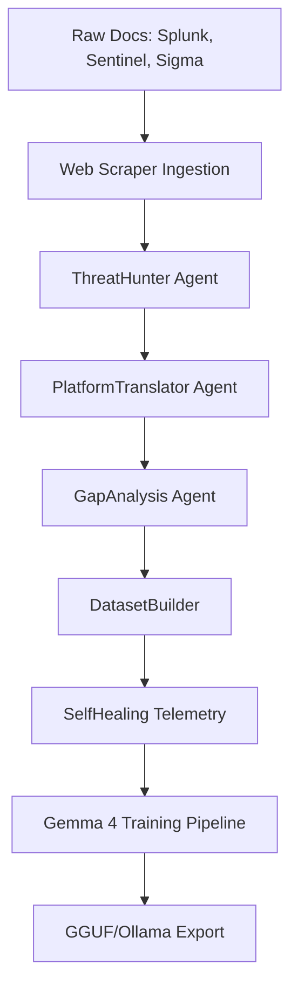
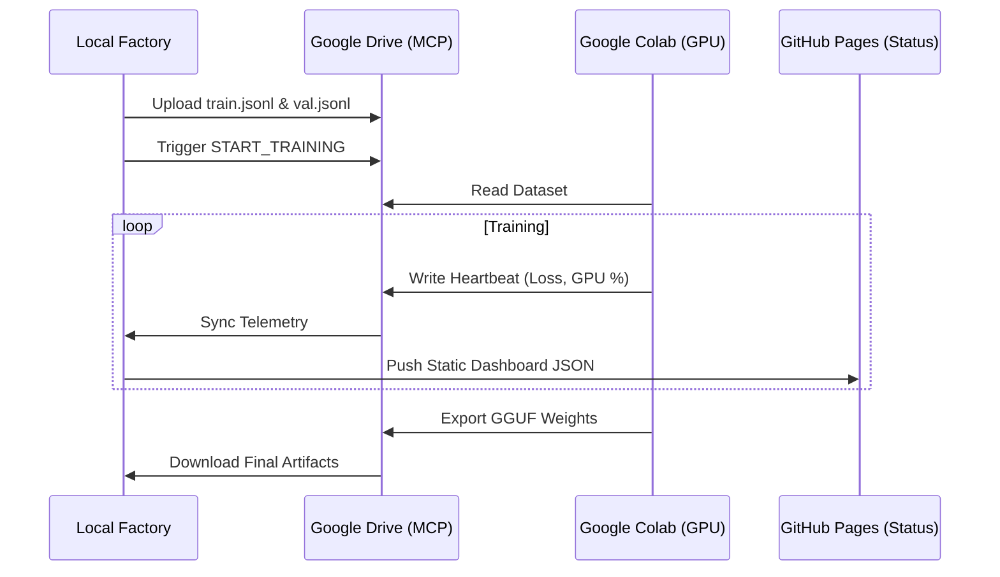

# BlueForge AI: Agentic SOC LLM Factory (Gemma 4 Edition)

BlueForge AI is a cloud-native, semi-automated pipeline designed to continuously transform raw SOC documentation into fine-tuned, evaluated LLM artifacts. Now optimized for **Gemma 4 (E2B/E4B)**, the platform prioritizes a "Training-First" strategy with robust, self-healing telemetry.

---

## 🏗️ Core Architecture: The Gemma Swarm

The factory operates as an agentic swarm, where specialized models collaborate to refine security data into high-quality training sets.



### Specialized Swarm Agents
- **🕵️ ThreatHunter:** Extracts indicators (IPs, domains) and behavioral patterns from raw security documentation.
- **🌍 PlatformTranslator:** Translates detection logic between SIEM/SOAR platforms (e.g., SPL to KQL, Sigma to Sentinel).
- **📉 GapAnalysis:** Identifies missing telemetry links and correlation windows in existing detections.
- **🛡️ SelfHealing:** Monitors pipeline health and autonomously repairs dataset drift or schema mismatches.

---

## 🚀 Training-First Strategy: Colab MCP Bridge

The training pipeline is decoupled from the ingestion factory, allowing for remote, GPU-accelerated fine-tuning via Google Colab.



---

## 📊 Self-Healing Telemetry & Dashboard

The platform monitors its own data integrity to prevent model "poisoning" or performance drift.

- **PipelineHealthCheck:** Baselines dataset size and enforces strict schema compliance.
- **SignalDriftDetector:** Uses Jaccard-based content analysis to identify significant shifts in security telemetry (e.g., shifting from "Auth" logs to "Cloud" logs).
- **Real-time Dashboard:** A Streamlit-based console featuring loss curves, GPU utilization, and pipeline health scores.

---

## 🛠️ Getting Started

### 1. Install Dependencies
```bash
pip install -r requirements.txt
```

### 2. Configure Environment
Copy `.env.example` to `.env` and set your provider credentials (OpenAI, Anthropic, Gemini) and Google Drive API keys.

### 3. Run the Factory
```bash
# Run a single automation cycle
python -m agentic_soc_factory.cli daemon-once

# Start the Streamlit Dashboard
streamlit run dashboard/app.py
```

---

## 📁 Repository Layout

- `agentic_soc_factory/`: Core logic and agent swarm implementation.
  - `ingestion/`: Platform-agnostic scrapers (Sigma, Splunk, Sentinel).
  - `telemetry/`: Self-healing health and drift monitoring.
  - `training/`: Google Drive / MCP bridge for Colab.
- `dashboard/`: Streamlit monitoring app.
- `docs/superpowers/specs/`: Detailed design and architecture documents.
- `secops_rag/`: Local storage for security documentation.
- `artifacts/`: SQLite database (`factory.db`) and local dataset exports.

---

## 📜 License
BlueForge AI is open-source. See the repository for full license details.
